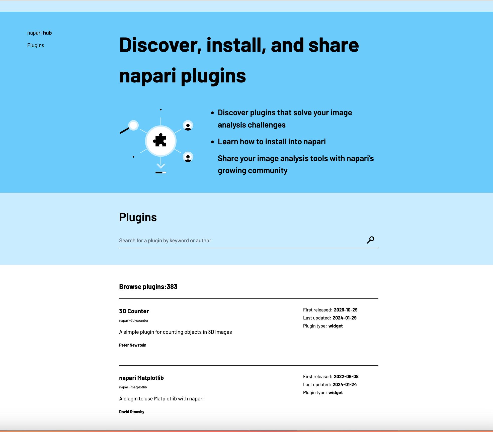

# Napari Hub Lite

[](https://results.pre-commit.ci/latest/github/napari/hub-lite/main)


### Author: Yunha Lee

### Disclaimer
This is an experiment to see how much of napari-hub functionality can be achieved in a github page. 

### Introduction
Napari Hub Lite seeks to demonstrate how much of the dynamic content and user experience of the original napari hub can be emulated in a github page. This project is particularly focused on the use of napari plugin data to create a simplified, yet functional, representation of the napari hub's capabilities. 



### Prerequisites
Before proceeding with the setup and usage of Napari Hub Lite, ensure you have the following prerequisites installed:
- Python 3.x
- Flask (for running the search functionality)
- Other dependencies listed in `requirements.txt`

### Getting Started

1. **Fetch Napari Plugin Data**  
   The napari plugin data is sourced from the following API endpoint: [https://npe2api.vercel.app/api/](https://npe2api.vercel.app/api/). To fetch, clean, and preprocess this data, execute the command:
   ```
   python fetch_napari_data.py
   ```

2. **Create static htmls**  
This will create static_index.html and individual plugins htmls under the plugins folder:
```
python create_static_html_files.py
```
Note that github pages uses index.html and html files under the plugins folder.  

Alternatively, if you want to run a local server using python flask:
First, you need to uncomment out the last blocks in create_static_html_files.py to generate /static/plugins/ directory. 
Then, do this: 
```
python search_results.py
```


### Implementation Details
To ensure the visual and functional fidelity of the site with respect to the original napari hub, I have used their CSS and HTML codes to the maximum extent possible. This approach allows me to closely mimic the user experience and interface design of the original platform.

### Acknowledgments
This project makes extensive use of the design and html code resources from the original napari hub, which should be credited to the creators and maintainers of the original napari hub. 


---

This project is an exploratory initiative and is not officially associated with the napari hub. 
